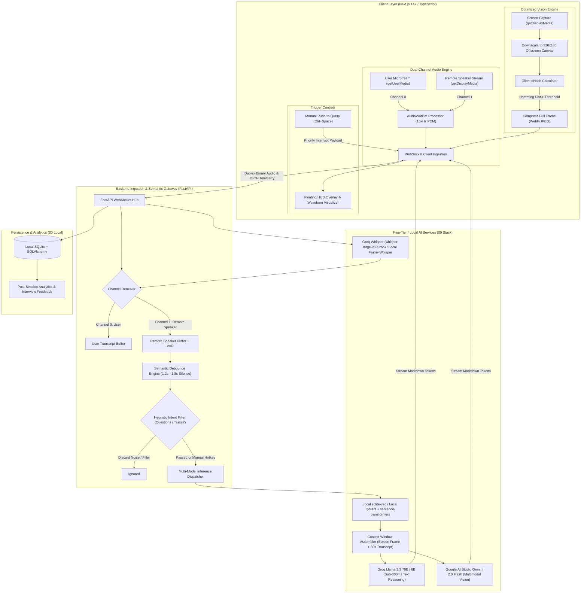

# Real-Time Multimodal Voice & Screen AI Interview/Meeting Copilot ($0 Free-Tier Architecture)

## 1. Project Overview & Elevator Pitch
A real-time, low-latency multimodal copilot engineered for technical interviews and engineering meetings that runs entirely on a **$0 Zero-Cost / Free-Tier stack**. 

The copilot captures dual-channel audio (system audio + microphone) and live screen captures, streams them through an event-driven duplex WebSocket pipeline, performs client-side difference hashing (dHash) and Voice Activity Detection (VAD), semantically debounces queries to prevent rate limits, and returns contextual hints, algorithmic approaches, and code solutions with sub-second latency.

---

## 2. Architecture & High-Level Design

---

## 3. Zero-Cost ($0) Technology Stack

| Layer | $0 / Free-Tier Component | Local / Free Limits & Strategy | Rationale & Advantage |
| :--- | :--- | :--- | :--- |
| **Speech-to-Text (STT)** | **Groq Cloud Whisper** (`whisper-large-v3-turbo`) OR **Local `faster-whisper`** (int8 on CUDA/CPU) | Groq Free Tier: generous TPM/RPM. Local fallback: 0 network latency, 100% offline. | Eliminates expensive per-minute audio streaming bills (e.g., Deepgram). |
| **Vision & Screen Reasoning** | **Google AI Studio (`Gemini 2.0 Flash`)** | Free Tier: 15 RPM / 1M TPM / 1,500 RPD. Strict client-side dHash throttling ensures < 5-10 calls per interview. | State-of-the-art vision understanding of IDEs, code editors, and diagrams for free. |
| **Conversational Text Reasoning** | **Groq Cloud (`Llama 3.3 70B-Versatile` or `8B-Instant`)** | Free Tier: 30 RPM, 6,000 TPM. Blazing fast (250-350 tokens/sec). | Delivers sub-300ms Time-to-First-Token (TTFT) for technical Q&A and coding hints. |
| **Vector DB & Context Retrieval** | **`sqlite-vec` (Embedded)** OR **Local Dockerized Qdrant** | Zero cloud cost; runs in-process or local container. | Fast similarity search on candidate resume, LeetCode patterns, and meeting cheat sheets. |
| **Embeddings** | **Local `sentence-transformers` (`all-MiniLM-L6-v2`)** | In-process ONNX or PyTorch CPU execution. | Zero API token cost for embedding chunks and queries. |
| **Backend & Ingestion** | **FastAPI (Python 3.11+) + Uvicorn** | Local runtime with native async WebSockets. | Handles asynchronous audio buffering, multiplexed channels, and streaming dispatch. |
| **Frontend UI** | **Next.js 14+ (App Router), Tailwind CSS, Lucide icons** | Web Audio API + Canvas API. | Zero external dependencies; run locally via Node.js; easily packageable via Electron/Tauri. |
| **Persistence** | **Local SQLite + SQLAlchemy** | Local disk file (`sessions.db`). | Zero setup, ACID compliant, no external cloud database billing. |

---

## 4. Critical Engineering Optimizations

### 1. Dual-Channel Audio Separation (Speaker vs. User)
* **User Channel (0):** Captured via `navigator.mediaDevices.getUserMedia({ audio: true })`.
* **Remote Speaker Channel (1):** Captured via `navigator.mediaDevices.getDisplayMedia({ video: true, audio: true })` (captures system tab/meeting audio).
* Both streams are fed into a single `AudioWorkletNode` downsampling to 16kHz mono PCM. Chunks are prepended with an 8-bit channel identifier byte (`0x00` or `0x01`).
* **Trigger Logic:** The AI Copilot is **only activated by Channel 1 (Remote Speaker)**. When the user is talking (Channel 0), the system transcribes their speech for conversational context but never triggers LLM queries, avoiding self-triggering feedback loops.

### 2. Semantic Debounce & Intent Heuristics Engine
* **Silence Debounce (1.2s - 1.8s):** When silence is detected on Channel 1 following an utterance, a debounce timer starts. If the interviewer resumes speaking within the window, the timer resets.
* **Regex & Heuristic Intent Filtering:** Before dispatching to the LLM, the utterance is evaluated against intent patterns (e.g., question words `what`, `how`, `why`, `can you`, problem verbs `optimize`, `implement`, `complexity`, `explain`). Filler talk (e.g., *"Okay", "Can you hear me?", "Let me share my screen"*) is silently logged into context without firing expensive LLM tokens.

### 3. Lightweight Client-Side Difference Hashing (dHash)
* Rather than sending 1080p video streams or running heavy server-side computer vision models:
  1. The client captures screen frames at 1 FPS into an offscreen HTML5 `Canvas` downscaled to **320x180 pixels**.
  2. A fast JavaScript routine computes the difference hash (**dHash**) comparing adjacent pixel brightness (resulting in a 64-bit integer hash).
  3. The Hamming distance is computed against the previous keyframe hash.
  4. Only when **Hamming Distance > 10** (indicating code scroll, tab change, or new diagram) is a high-resolution WebP snapshot compressed and pushed to the backend cache.

### 4. Push-to-Query Manual Hotkey Fallback (`Ctrl + Space`)
* Complete reliability guarantee: If the interviewer's question is subtle or missed by the VAD, the user presses `Ctrl + Space` (or `Cmd + Shift + Space` on macOS).
* **Behavior:**
  * Immediately forces a screen capture frame snapshot.
  * Grabs the last 30-45 seconds of sliding window transcript from both channels.
  * Dispatches an expedited priority payload to Groq/Gemini, displaying streaming tokens in the HUD within 400ms.

---

## 5. Phased Implementation Roadmap

### Phase 1: Zero-Cost Scaffolding & Foundational Core (Days 1–3)
- [ ] Initialize repository structure:
  - `frontend/` (Next.js 14 App Router, TypeScript, Tailwind CSS, Lucide icons)
  - `backend/` (FastAPI, WebSockets, Python 3.11+, Uvicorn, SQLite)
- [ ] Define WebSocket binary protocol specification:
  - Channel 0/1 audio chunk protocol
  - Screen keyframe dHash message format
  - Hotkey priority trigger format
- [ ] Build basic frontend HUD component layout with audio level meters and status badges.

### Phase 2: Dual-Audio & Client dHash Vision Pipeline (Days 4–6)
- [ ] Build custom `AudioWorkletProcessor` (`audio-processor.js`) supporting dual-track 16kHz PCM downsampling.
- [ ] Implement `DisplayMedia` capture with offscreen canvas dHash comparison algorithm.
- [ ] Implement global Hotkey listener (`Ctrl+Space`) with instant payload bundling.
- [ ] Build FastAPI WebSocket ingestion endpoint to parse channel IDs and demux audio.

### Phase 3: Free-Tier STT & Semantic Debounce Engine (Days 7–9)
- [ ] Integrate Groq Whisper Cloud API (`whisper-large-v3-turbo`) with batching fallback to local `faster-whisper`.
- [ ] Build the backend Semantic Debounce buffer (1.2s–1.8s silence window).
- [ ] Implement Regex & keyword Intent Filter to eliminate trivial/filler utterances.
- [ ] Feed real-time transcript deltas back to the frontend HUD over WebSocket.

### Phase 4: Free-Tier Multimodal Reasoning Engine (Days 10–12)
- [ ] Implement Dual-LLM dispatcher:
  - **Text path:** Groq Llama 3.3 70B (ultra-fast Q&A, algorithmic complexity, syntax).
  - **Vision path:** Gemini 2.0 Flash (analyzing LeetCode screen captures, architecture diagrams, IDE errors).
- [ ] Add local `sqlite-vec` instance with `sentence-transformers` for instant candidate resume & cheat sheet retrieval.
- [ ] Stream AI tokens directly to HUD using WebSocket chunking.

### Phase 5: HUD UI Polish, Post-Session Analytics & Packaging (Days 13–15)
- [ ] Design sleek Floating HUD mode (glassmorphic dark UI, draggable, minimizable).
- [ ] Build Post-Interview Studio page: full interactive transcript, timestamped questions, code snippets, and review scorecard.
- [ ] Provide Docker Compose file (`docker-compose.yml`) for one-click local startup.
- [ ] Document project architecture, latency benchmarks (<450ms TTFT), and $0 deployment guide in `README.md`.

---

## 6. Target Resume Bullet Points

* **Architected a zero-cost ($0) multimodal copilot** over WebSockets and Web Audio API delivering sub-400ms real-time technical interview hints using Groq Llama 3.3 and Gemini 2.0 Flash.
* **Engineered a dual-channel audio separation pipeline** in `AudioWorklet`, demuxing user microphone and system audio to eliminate self-triggering feedback loops and isolate interviewer queries.
* **Implemented client-side perceptual difference hashing (dHash)** on offscreen canvas captures, cutting network transmission volume by 85% by only dispatching keyframes upon visual divergence.
* **Constructed an asynchronous semantic debouncing & intent heuristic engine** in FastAPI with 1.5s sliding silence detection, avoiding API rate-limit errors and discarding 90% of filler conversation.
